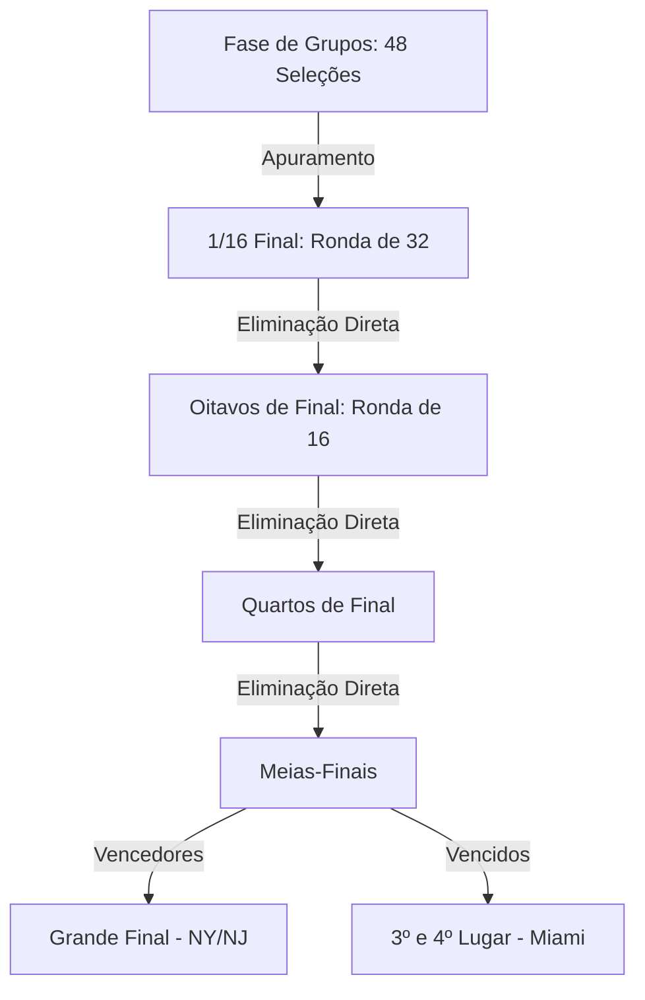

# 🏛️ Império BetOn: Calendário Oficial & Estrutura do Mundial 2026

Com o novo formato alargado, o **Campeonato do Mundo de 2026** terá um total histórico de **104 jogos**. Este documento serve como o nosso mapa de estradas analítico, mapeando geograficamente todos os estádios e organizando cronologicamente todos os confrontos da fase de grupos e eliminatórias para a calibração de estratégias quantitativas e simulação de banca.

---

## 🗺️ 1. Estrutura e Estádios Oficiais

Devido às regras rígidas de naming da FIFA para marcas não-patrocinadoras, vários estádios mundialmente famosos utilizam nomes oficiais alternativos durante o torneio. O ecossistema está dividido por **3 países** e **16 cidades**:

### 🇺🇸 Estados Unidos (11 Estádios)
| Cidade | Nome Oficial FIFA | Nome Comercial de Referência |
| :--- | :--- | :--- |
| **Dallas** | Dallas Stadium | AT&T Stadium |
| **Nova Iorque / Nova Jérsia** | New York New Jersey Stadium | MetLife Stadium |
| **Los Angeles** | Los Angeles Stadium | SoFi Stadium |
| **Miami** | Miami Stadium | Hard Rock Stadium |
| **Boston** | Boston Stadium | Gillette Stadium |
| **Atlanta** | Atlanta Stadium | Mercedes-Benz Stadium |
| **Houston** | Houston Stadium | NRG Stadium |
| **Kansas City** | Kansas City Stadium | Arrowhead Stadium |
| **Filadélfia** | Philadelphia Stadium | Lincoln Financial Field |
| **São Francisco (Bay Area)** | San Francisco Bay Area Stadium | Levi's Stadium |
| **Seattle** | Seattle Stadium | Lumen Field |

### 🇲🇽 México (3 Estádios)
| Cidade | Nome Oficial FIFA | Nome Comercial de Referência |
| :--- | :--- | :--- |
| **Cidade do México** | Mexico City Stadium | Estadio Azteca |
| **Guadalajara** | Estadio Guadalajara | Estadio Akron |
| **Monterrey** | Estadio Monterrey | Estadio BBVA |

### 🇨🇦 Canadá (2 Estádios)
| Cidade | Nome Oficial FIFA | Nome Comercial de Referência |
| :--- | :--- | :--- |
| **Vancouver** | BC Place Vancouver | BC Place |
| **Toronto** | Toronto Stadium | BMO Field |

---

## 🗓️ 2. Calendário Integral: Fase de Grupos

### 📅 Semana 1: Abertura e Estreias das Seleções
| Data | Grupo | Jogo | Estádio (Cidade) |
| :--- | :---: | :---: | :--- |
| **Quinta, 11 Junho** | A | México 🆚 África do Sul | Mexico City Stadium (C. do México) |
| | A | Coreia do Sul 🆚 Chéquia | Estadio Guadalajara (Guadalajara) |
| **Sexta, 12 Junho** | B | Canadá 🆚 Bósnia e Herzegovina | Toronto Stadium (Toronto) |
| | D | EUA 🆚 Paraguai | Los Angeles Stadium (Los Angeles) |
| **Sábado, 13 Junho** | B | Catar 🆚 Suíça | San Francisco Bay Area Stadium |
| | C | Brasil 🆚 Marrocos | New York New Jersey Stadium |
| | C | Haiti 🆚 Escócia | Boston Stadium (Boston) |
| | D | Austrália 🆚 Turquia | BC Place Vancouver (Vancouver) |
| **Domingo, 14 Junho** | E | Alemanha 🆚 Curaçau | Houston Stadium (Houston) |
| | F | Países Baixos 🆚 Japão | Dallas Stadium (Dallas) |
| | E | Costa do Marfim 🆚 Equador | Philadelphia Stadium (Filadélfia) |
| | F | Suécia 🆚 Tunísia | Estadio Monterrey (Monterrey) |
| **Segunda, 15 Junho** | H | Arábia Saudita 🆚 Uruguai | Miami Stadium (Miami) |
| | H | Espanha 🆚 Cabo Verde | Atlanta Stadium (Atlanta) |
| | G | Irão 🆚 Nova Zelândia | Los Angeles Stadium (Los Angeles) |
| | G | Bélgica 🆚 Egito | Seattle Stadium (Seattle) |
| **Terça, 16 Junho** | I | França 🆚 Senegal | New York New Jersey Stadium |
| | I | Iraque 🆚 Noruega | Boston Stadium (Boston) |
| | J | Argentina 🆚 Argélia | Kansas City Stadium (Kansas City) |
| | J | Áustria 🆚 Jordânia | San Francisco Bay Area Stadium |
| **Quarta, 17 Junho** | L | Gana 🆚 Panamá | Toronto Stadium (Toronto) |
| | L | Inglaterra 🆚 Croácia | Dallas Stadium (Dallas) |
| | K | Portugal 🆚 RD Congo | Houston Stadium (Houston) |
| | K | Usbequistão 🆚 Colômbia | Mexico City Stadium (C. do México) |

---

### 📅 Semana 2: Segunda Ronda (Ponto de Viragem)
| Data | Grupo | Jogo | Estádio (Cidade) |
| :--- | :---: | :---: | :--- |
| **Quinta, 18 Junho** | A | Chéquia 🆚 África do Sul | Atlanta Stadium (Atlanta) |
| | B | Suíça 🆚 Bósnia e Herzegovina | Los Angeles Stadium (Los Angeles) |
| | B | Canadá 🆚 Catar | BC Place Vancouver (Vancouver) |
| | A | México 🆚 Coreia do Sul | Estadio Guadalajara (Guadalajara) |
| **Sexta, 19 Junho** | C | Brasil 🆚 Haiti | Philadelphia Stadium (Filadélfia) |
| | C | Escócia 🆚 Marrocos | Boston Stadium (Boston) |
| | D | Turquia 🆚 Paraguai | San Francisco Bay Area Stadium |
| | D | EUA 🆚 Austrália | Seattle Stadium (Seattle) |
| **Sábado, 20 Junho** | E | Alemanha 🆚 Costa do Marfim | Toronto Stadium (Toronto) |
| | E | Equador 🆚 Curaçau | Kansas City Stadium (Kansas City) |
| | F | Países Baixos 🆚 Suécia | Houston Stadium (Houston) |
| | F | Tunísia 🆚 Japão | Estadio Monterrey (Monterrey) |
| **Domingo, 21 Junho** | H | Uruguai 🆚 Cabo Verde | Miami Stadium (Miami) |
| | H | Espanha 🆚 Arábia Saudita | Atlanta Stadium (Atlanta) |
| | G | Bélgica 🆚 Irão | Los Angeles Stadium (Los Angeles) |
| | G | Nova Zelândia 🆚 Egito | BC Place Vancouver (Vancouver) |
| **Segunda, 22 Junho** | I | Noruega 🆚 Senegal | New York New Jersey Stadium |
| | I | França 🆚 Iraque | Philadelphia Stadium (Filadélfia) |
| | J | Argentina 🆚 Áustria | Dallas Stadium (Dallas) |
| | J | Jordânia 🆚 Argélia | San Francisco Bay Area Stadium |
| **Terça, 23 Junho** | L | Inglaterra 🆚 Gana | Boston Stadium (Boston) |
| | L | Panamá 🆚 Croácia | Toronto Stadium (Toronto) |
| | K | Portugal 🆚 Usbequistão | Houston Stadium (Houston) |
| | K | Colômbia 🆚 RD Congo | Estadio Guadalajara (Guadalajara) |

---

### 📅 Semana 3: Decisões da Fase de Grupos (Jogos em Simultâneo)
> [!NOTE]
> Para assegurar a integridade e verdade desportiva do torneio, os jogos da última jornada de cada grupo são disputados obrigatoriamente à mesma hora.

| Data | Grupo | Jogo | Estádio (Cidade) |
| :--- | :---: | :---: | :--- |
| **Quarta, 24 Junho** | C | Escócia 🆚 Brasil | Miami Stadium (Miami) |
| | C | Marrocos 🆚 Haiti | Atlanta Stadium (Atlanta) |
| | B | Suíça 🆚 Canadá | BC Place Vancouver (Vancouver) |
| | B | Bósnia e H. 🆚 Catar | Seattle Stadium (Seattle) |
| | A | Chéquia 🆚 México | Mexico City Stadium (C. do México) |
| | A | África do Sul 🆚 Coreia do Sul | Estadio Monterrey (Monterrey) |
| **Quinta, 25 Junho** | E | Curaçau 🆚 Costa do Marfim | Philadelphia Stadium (Filadélfia) |
| | E | Equador 🆚 Alemanha | New York New Jersey Stadium |
| | F | Japão 🆚 Suécia | Dallas Stadium (Dallas) |
| | F | Tunísia 🆚 Países Baixos | Kansas City Stadium (Kansas City) |
| | D | Turquia 🆚 EUA | Los Angeles Stadium (Los Angeles) |
| | D | Paraguai 🆚 Austrália | San Francisco Bay Area Stadium |
| **Sexta, 26 Junho** | H | Uruguai 🆚 Espanha | Miami Stadium (Miami) |
| | H | Cabo Verde 🆚 Arábia Saudita | Houston Stadium (Houston) |
| | G | Nova Zelândia 🆚 Bélgica | San Francisco Bay Area Stadium |
| | G | Egito 🆚 Irão | Seattle Stadium (Seattle) |
| | I | Noruega 🆚 França | Boston Stadium (Boston) |
| | I | Senegal 🆚 Iraque | Toronto Stadium (Toronto) |
| **Sábado, 27 Junho** | J | Jordânia 🆚 Argentina | Estadio Monterrey (Monterrey) |
| | J | Argélia 🆚 Áustria | Estadio Guadalajara (Guadalajara) |
| | K | Colômbia 🆚 Portugal | Miami Stadium (Miami) |
| | K | RD Congo 🆚 Usbequistão | Mexico City Stadium (C. do México) |
| | L | Panamá 🆚 Inglaterra | New York New Jersey Stadium |
| | L | Croácia 🆚 Gana | Philadelphia Stadium (Filadélfia) |

---

## 🏆 3. Estrutura das Fases a Eliminar (Finais)

O apuramento para as rondas eliminatórias é constituído pelos **2 primeiros classificados de cada grupo** juntamente com os **8 melhores terceiros classificados** de todo o torneio.

### 🔹 Dezasseis-avos de Final (Ronda de 32)
*   **Datas**: 28 de Junho a 3 de Julho
*   **Locais**: Boston, Dallas, Houston, Los Angeles, Miami, Nova Iorque, Filadélfia, São Francisco, Seattle, Kansas City, Atlanta, Vancouver, Toronto, Cidade do México e Monterrey.

### 🔹 Oitavos de Final
*   **Datas**: 4 a 7 de Julho
*   **Locais**: Vancouver, Seattle, Cidade do México, Houston, Dallas, Atlanta, Filadélfia e Nova Iorque/Nova Jérsia.

### 🔹 Quartos de Final
*   **Datas**: 9 a 11 de Julho
*   **Locais**: Boston Stadium, Los Angeles Stadium, Miami Stadium e Kansas City Stadium.

### 🔹 Meias-Finais
*   **Terça, 14 Julho**: Dallas Stadium (Dallas)
*   **Quarta, 15 Julho**: Atlanta Stadium (Atlanta)

### 🔹 Terceiro e Quarto Lugar
*   **Sábado, 18 Julho**: Miami Stadium (Miami)

### 🥇 A Grande Final
*   **Domingo, 19 Julho**: New York New Jersey Stadium (MetLife Stadium – East Rutherford)
