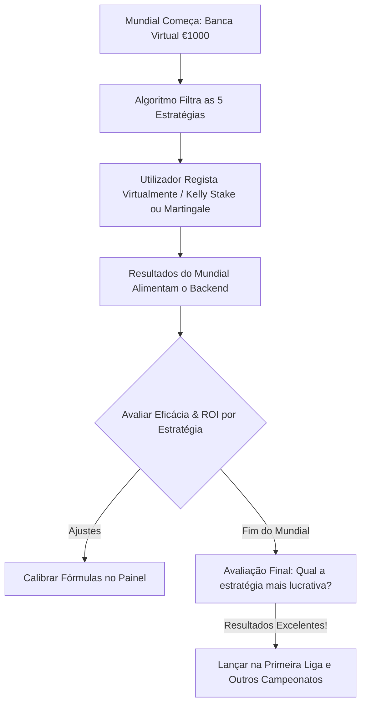

# 🏛️ BetOn: World Cup Edition - Análise de Valor & Simulação Virtual

Este documento estabelece o conceito estratégico, matemático e visual para o pivot do projeto **BetOn**. Em vez de criarmos uma base de dados pesada e incompleta de históricos, focamo-nos na **deteção de valor em tempo real** e na **simulação virtual de investimentos**, aplicando fórmulas financeiras ao futebol, com o **Campeonato do Mundo** como nosso laboratório inicial.

---

## 📈 1. A Filosofia: Futebol como um Mercado Financeiro

Em vez de encarar as apostas como um jogo de azar, tratamos cada odd como uma ação cotada em bolsa. O nosso objetivo é encontrar **Ações Subavaliadas (Value Bets)** onde o preço de mercado (a odd) seja inferior ao valor real estimado pelo nosso algoritmo.

---

## 🧮 2. Como Calculamos a Probabilidade e o Valor Esperado (EV)?

Para calcular o **Valor Esperado (EV)**, precisamos da nossa própria estimativa de probabilidade ($P_{\text{algoritmo}}$) e compará-la com a odd da casa de apostas ($O_{\text{casa}}$):

$$EV = (P_{\text{algoritmo}} \times \text{Odd}_{\text{casa}}) - 1$$

Se o resultado for maior que zero ($EV > 0$), significa que a casa está a pagar mais do que a probabilidade real justifica. **É um negócio lucrativo a longo prazo.**

### 🔍 Como Calculamos $P_{\text{algoritmo}}$ (Sem Bases de Dados Pesadas)?

Propomos um sistema híbrido leve e ultra-preciso com **três fontes matemáticas**:

1.  **Fórmula 1: ELO Rating das Seleções Nacionais (Estabilidade Global)**
    *   O ELO é o sistema matemático mais fiável do mundo (usado no Xadrez e adaptado ao futebol).
    *   Mantemos uma tabela simples de ratings ELO das seleções do Mundial.
    *   A diferença de ELO entre duas equipas (com ajuste de campo neutro para o Mundial) dá-nos uma probabilidade matemática exata de Vitória/Empate/Derrota através da função logística.

2.  **Fórmula 2: Consenso do Mercado Afiado (Sharp Bookmaker Margin Removal)**
    *   Bookmakers "Sharp" (como a **Pinnacle**) definem as odds mais precisas do mundo com margens muito baixas.
    *   O nosso backend lê a odd da Pinnacle, remove a margem teórica da casa (o "vig" ou comissão) para descobrir a **Probabilidade Real do Mercado Consensual**.
    *   **Deteção de Valor**: Se a **Betano** ou a **Betclic** em Portugal estiverem lentas a atualizar ou a oferecer uma odd superior à probabilidade real da Pinnacle, o sistema emite um alerta imediato de compra!

3.  **Fórmula 3: Distribuição de Poisson baseada nos Qualificadores**
    *   Usamos a **API-Football** para obter dinamicamente os golos marcados e sofridos de cada equipa nos últimos 8 jogos oficiais.
    *   Calculamos a força de ataque e defesa de cada seleção e aplicamos a **Distribuição de Poisson** para simular o jogo 10.000 vezes e obter as percentagens de golos (Over/Under) e 1X2.

---

## ⚡ 3. O Portfólio de Estratégias Quantitativas (Filosofia do Rei Paulo)

Seguindo o princípio fundamental: **"1º Criar estratégias matemáticas que nos favoreçam; 2º Encontrar os melhores jogos para cada estratégia."**

Focamo-nos prioritariamente em mercados com **2 resultados (50/50 de base)** ou **coberturas de 66.6% (Chance Dupla)**, onde o "inesperado" gera odds desajustadas e de alto valor.

### 🔄 Estratégia I: Ambas Marcam SIM $\ge 2.00$ (Martingale de Alta Sobrevivência)
*   **Mercado**: Ambas Equipas Marcam (BTTS SIM). ➔ **50/50**
*   **Lógica**: Focamo-nos apenas em odds $\ge 2.00$. Com odd de 2.00, o Martingale de duplicação simples ($1€, 2€, 4€, 8€, 16€, 32€$) funciona a 100% para recuperar perdas e lucrar 1€ a cada ciclo.
*   **O Filtro**: O scanner procura jogos com BTTS SIM $\ge 2.00$ e probabilidade de Poisson $> 52\%$.
*   **Banca (100€)**: Suporta **6 derrotas consecutivas** (gasto total de 63€).

### 🦓 Estratégia II: A Zebra Protegida (Chance Dupla X2 / 1X de Valor)
*   **Mercado**: Chance Dupla (Empate ou Vitória do Underdog). ➔ **66.6% de cobertura de resultados**.
*   **O Inesperado**: Casas de apostas sobrevalorizam sistematicamente grandes equipas com base na fama. Quando um favorito está em baixa de forma (RSI fraco) ou desfalcado, a odd para a Chance Dupla do adversário (X2) sobe imenso (ex: de 1.40 para **1.85 ou 2.00**).
*   **O Filtro**: Odd da Chance Dupla $\ge 1.80$ + Probabilidade estimada pelo modelo ELO/RSI $\ge 70\%$.
*   **Vantagem**: Cobrimos 2 dos 3 resultados possíveis com uma odd excelente e alta segurança!

### ⚽ Estratégia III: Linha de Golos Inteligente (Over/Under 2.5)
*   **Mercado**: Mais/Menos 2.5 Golos. ➔ **50/50**
*   **O Inesperado**: Procuramos jogos de equipas com reputação de defensivas (o que empurra a odd do "Mais de 2.5 Golos" para cima de **2.10**), mas cujos últimos 5 jogos mostrem uma mudança tática ou atacantes em forma, com média real de golos superior a 3.0.
*   **O Filtro**: Odd do Over 2.5 $\ge 2.10$ + Probabilidade real de Poisson $> 55\%$.

### ⏱️ Estratégia IV: Rastreador de Favoritos ao Intervalo (In-Play)
*   **Mercado**: Vitória do Super Favorito ao Vivo (In-Play).
*   **O Inesperado**: Um super favorito pré-jogo (odd < 1.30) chega empatado aos 35-40 minutos ou ao intervalo. A odd live dispara de **1.15 para $\ge 1.50$**, mantendo a alta probabilidade de vitória na segunda parte.
*   **O Filtro**: Jogo empatado no minuto 40+ com odd live $\ge 1.50$ para o favorito.

### 🛡️ Estratégia V: O Favorito Empatado (Draw No Bet - DNB)
*   **Mercado**: Empate Anula Aposta (DNB 1 ou 2). ➔ **Redução para 2 resultados**.
*   **Lógica**: Apostamos na vitória de uma equipa. Se o jogo terminar empatado, a aposta é devolvida (reembolso total), eliminando o risco do empate e transformando o mercado num 50/50 puro com proteção.
*   **O Filtro**: Odd do DNB $\ge 1.70$ para a equipa com clara superioridade de ELO.

---

## 🎮 4. Funcionalidades da WebApp (Painel do Mundial)

1.  **Dashboard "Bolsa de Valores BetOn"**:
    *   Lista de jogos do dia do Mundial e outras ligas ativas com as odds em tempo real (Betano, Betclic, Pinnacle).
    *   **Indicador de Oportunidade**: Cada jogo terá um selo indicador (ex: `🔥 EXCELENTE NEGÓCIO (EV +18%)`, `⚖️ VALOR NEUTRO`, `❌ EV NEGATIVO`).
2.  **Central de Estratégias Quantitativas**:
    *   Abas na interface dedicadas a cada uma das **5 Estratégias** do portfólio.
    *   O utilizador clica em "Estratégia II: A Zebra Protegida" e a WebApp exibe instantaneamente apenas as partidas em todo o mundo que satisfazem esses critérios exatos de 66.6% de acerto e odd alta!
3.  **Simulador de Banca Virtual**:
    *   Banca inicial configurável (ex: €1.000).
    *   **Registo com Um Clique**: O utilizador pode simular a aposta sugerida pelo sistema. O sistema deduz o valor da banca de forma virtual.
    *   **Liquidação Automática**: Logo que o jogo termina, o backend recolhe o resultado real via API e atualiza a banca automaticamente (Ganha / Perdida) sem que o utilizador precise de introduzir nada.
4.  **Consola Martingale Inteligente**:
    *   O utilizador insere a banca destinada à estratégia (ex: 100€), a odd média do mercado e o lucro pretendido por ciclo.
    *   A WebApp calcula e exibe em tempo real o **Índice de Sobrevivência** (quantos jogos errados suporta) e as stakes exatas para cada passo do ciclo de forma automática!
5.  **Painel de Calibração Matemática**:
    *   Sliders na UI para o utilizador calibrar a fórmula em tempo real:
        *   *Peso do ELO*: [───●───]
        *   *Peso do Histórico Recente (Poisson)*: [─────●─]
        *   *Peso da Tendência de Mercado (Smart Money)*: [─●─────]
    *   Isso permite ajustar os algoritmos dinamicamente à medida que a competição avança.

---

## 🚀 5. Roteiro de Calibração (Fase de Teste à Implementação)

