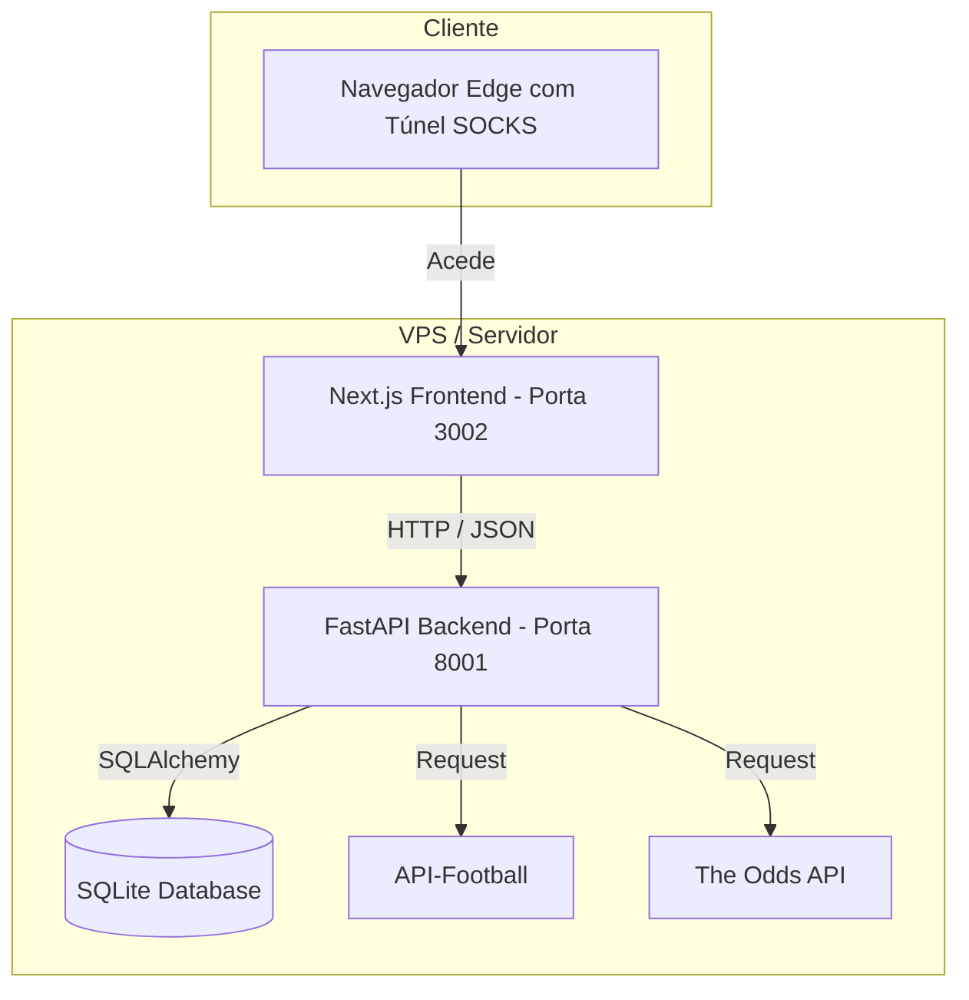

# 🏛️ Plano de Arquitetura e Implementação: BetOn do Zero

Bem-vindo ao renascimento do **BetOn**! Como **Olímpia (Senior Architect)**, estruturei o plano para criarmos uma plataforma de análise de apostas desportivas revolucionária, robusta e com uma experiência visual e interativa digna da realeza digital.

O nosso terreno está 100% limpo. O repositório Git local foi limpo e está pronto para receber as fundações de pedra do nosso novo castelo.

---

## 🏗️ 1. Arquitetura do Sistema

A nova arquitetura adota o isolamento total de responsabilidades, garantindo performance e escalabilidade:

### 🗄️ Modelo de Dados (SQLite - `beton_novo.db`)
O banco de dados SQLite será otimizado e estruturado para evitar qualquer tipo de duplicação:

1.  **`leagues`**: Registo das ligas monitorizadas (ID da API-Football, nome, país, logo, época ativa).
2.  **`teams`**: Equipas com mapeamento duplo (ID da API-Football e nome correspondente na The Odds API) para evitar conflitos na associação de dados.
3.  **`matches`**: Jogos agendados e históricos, contendo:
    *   `id` (API-Football)
    *   `home_team_id`, `away_team_id`
    *   `fixture_timestamp` (UTC)
    *   `status` (Not Started, In Play, Finished)
    *   `round` (Jornada)
    *   `home_score`, `away_score` (para liquidação automática de simulações)
4.  **`odds`**: Histórico e odds atuais das partidas obtidas via *The Odds API*:
    *   `match_id`
    *   `bookmaker` (ex: Betclic, Betano, Pinnacle)
    *   `odds_home`, `odds_draw`, `odds_away`
    *   `last_update`
5.  **`strategies`**: Modelos de simulação e regras de aposta (ex: "Back Home Odds > 1.80", "Ambas Marcam Sim em ligas com média > 2.5 golos").
6.  **`bets`**: Apostas simuladas ou registadas pelo utilizador para cálculo de ROI e gestão de banca:
    *   `match_id`, `strategy_id`, `stake` (quantia), `odds_taken`, `result` (Pendente, Ganha, Perdida).

---

## 🎨 2. Design System Premium (Frontend Next.js)

O novo frontend será desenhado sob princípios estéticos de luxo tecnológico:
*   **Esquema de Cores (Dark Mode Real)**:
    *   Background: `#0B0F19` (Azul escuro profundo / Espaço sideral)
    *   Card/Container: `#161D30` com bordas semi-transparentes de 1px (`#24324F`)
    *   Acentos Primários: Gradients fluidos de Royal Gold (`#D4AF37`) para Emerald Green (`#10B981`)
    *   Texto: `#F3F4F6` (Branco gelo) e `#9CA3AF` (Cinza suave para dados secundários)
*   **Tipografia**: Google Fonts `Outfit` (títulos imponentes) e `Inter` (dados e tabelas limpas).
*   **Micro-interações**: Hover cards dinâmicos com transisons de `0.3s ease-out`, efeitos de Glassmorphism e botões com brilho neon suave.

---

## 🚀 3. Roteiro de Desenvolvimento (Fases de Ataque)

### 📍 Fase 1: Fundação do Ecossistema (Imediato)
*   [ ] Criação do `docker-compose.yml` orquestrado com portas VPS seguras (`3002` e `8001`).
*   [ ] Configuração do FastAPI Backend básico com Dockerfile e dependências (`requirements.txt`).
*   [ ] Criação do Next.js Frontend base com estrutura de rotas limpa.
*   [ ] Estabelecer conexão de saúde (health check) entre os dois containers.

### 📊 Fase 2: Motor de Dados (Ingestão)
*   [ ] Criar coletores automáticos para a **API-Football** (obter calendário e classificação da Primeira Liga de Portugal e outras ligas de interesse).
*   [ ] Criar coletores para a **The Odds API** para extrair odds atuais dos principais bookmakers nacionais e estrangeiros.
*   [ ] Script de sincronização inteligente e mapeamento de nomes de equipas (ex: "Sporting CP" no API-Football vs "Sporting Lisbon" na Odds API).

### 🧠 Fase 3: Estratégias & Backtesting
*   [ ] Criação de construtor de estratégias personalizadas (filtros de odds, médias de golos, forma recente).
*   [ ] Simulador automático: corre as estratégias contra os resultados reais e calcula o ROI histórico de cada padrão!

### 📈 Fase 4: Dashboard do Império
*   [ ] Página principal do BetOn com as melhores oportunidades de aposta do dia (ordenadas por valor esperado - EV).
*   [ ] Central de Controlo de Banca (ROI, lucro acumulado, gráfico financeiro de evolução).

---

## 🛡️ 4. Próximos Passos (Ação Coordenada)

Para colocarmos o General Alex a marchar na VPS de forma rápida e segura, vamos estruturar os ficheiros de fundação no PC e subir a arquitetura.

> [!IMPORTANT]
> ### 👑 A Sua Aprovação
> Diga-me, meu Rei:
> 1. O plano de arquitetura e o design premium estão do seu agrado?
> 2. Deseja adicionar alguma liga de futebol específica para além da Primeira Liga portuguesa?
> 3. Prefere que o Next.js utilize **Tailwind CSS** (muito dinâmico para estilização de luxo com classes utilitárias) ou **Vanilla CSS puro**?
